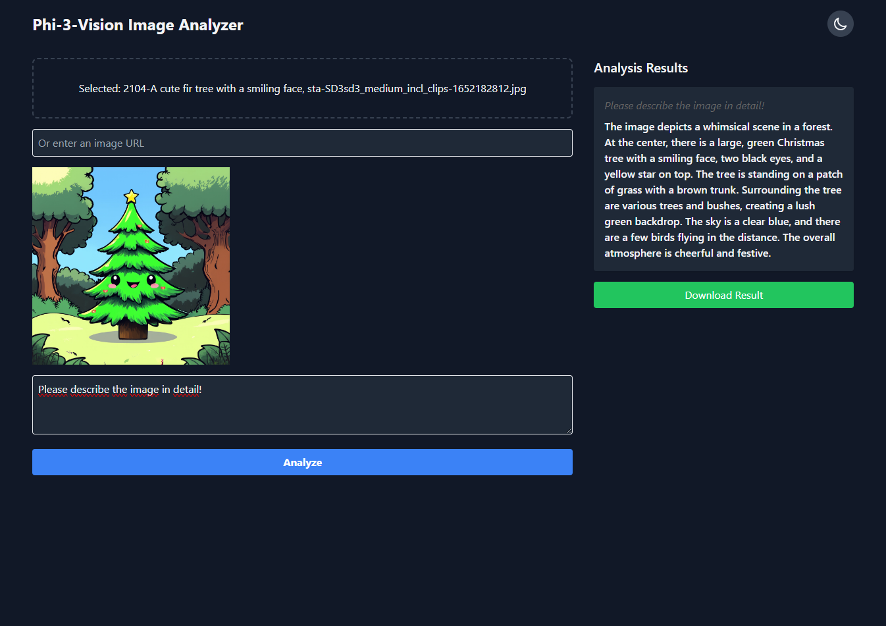

# Phi-3-Vision Image Analyzer

This is a web application that uses the Phi-3-Vision model to analyze images based on user prompts. Users can upload images or provide image URLs and ask questions or provide prompts about the image content.



## Features

- Image upload and URL input support
- Text-based prompts for image analysis
- Real-time analysis streaming
- Responsive design
- Support for both local and remote model loading

## Prerequisites

- Linux (required for FlashAttention2)
- Python 3.9+
- PyTorch
- Transformers library
- Flask
- Hugging Face account with access to the Phi-3-Vision model

## Installation

1. Clone the repository:
   ```
   git clone https://github.com/TanaroSch/phi3-vision-analyzer.git
   cd phi3-vision-analyzer
   ```

2. Create a virtual environment and activate it:
   ```
   python -m venv venv
   source venv/bin/activate
   ```

3. Install the required packages:
   ```
   pip install -r requirements.txt
   ```

4. Create a `.env` file in the project root and add the following:
   ```
   HUGGINGFACE_TOKEN=your_huggingface_token_here
   MODEL_PATH=/path/to/your/local/model
   ```

   - The `HUGGINGFACE_TOKEN` is optional if you're using a local model.
   - The `MODEL_PATH` should point to your local model directory if you have the model downloaded.

   To get a Hugging Face token (if needed):
   - Go to https://huggingface.co/settings/tokens
   - Click on "New token"
   - Give it a name and select the appropriate permissions (read for this application)
   - Copy the generated token and paste it into your `.env` file

## Usage

1. Start the Flask application:
   ```
   python app.py
   ```

2. Open a web browser and navigate to `http://localhost:5000`. This might take a wile to be available, as the checkpoint shareds have to be loaded.

3. Upload an image or provide an image URL.

4. Enter a prompt or question about the image in the text area.

5. Click "Analyze" to start the analysis.

6. View the analysis results as they stream in.

## Note

- If you have a local copy of the model, make sure to set the `MODEL_PATH` in the `.env` file.
- If you don't have a local copy, ensure you have set the `HUGGINGFACE_TOKEN` and have the necessary permissions to access the Phi-3-Vision model.